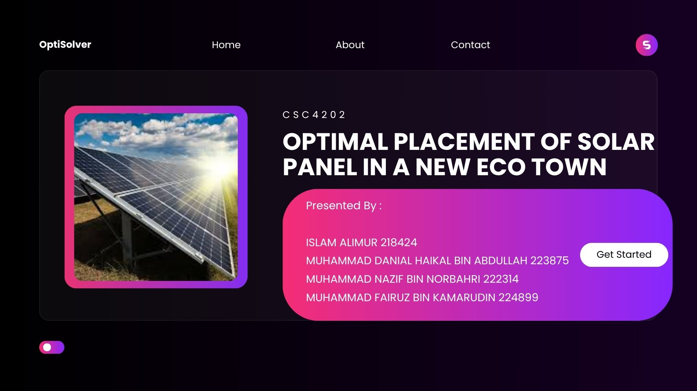
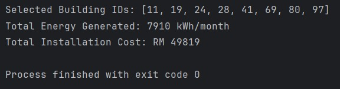

☀️ Solar Panel Optimization for Eco-Town (Negeri Sembilan)

Steps to Run the Code

1.Make sure the solar_data.csv is downloaded

2.Change the file path to match your CSV location.

3.Open SolarOptimization.java in any code editor.

4.Run the code

Expected Output :

